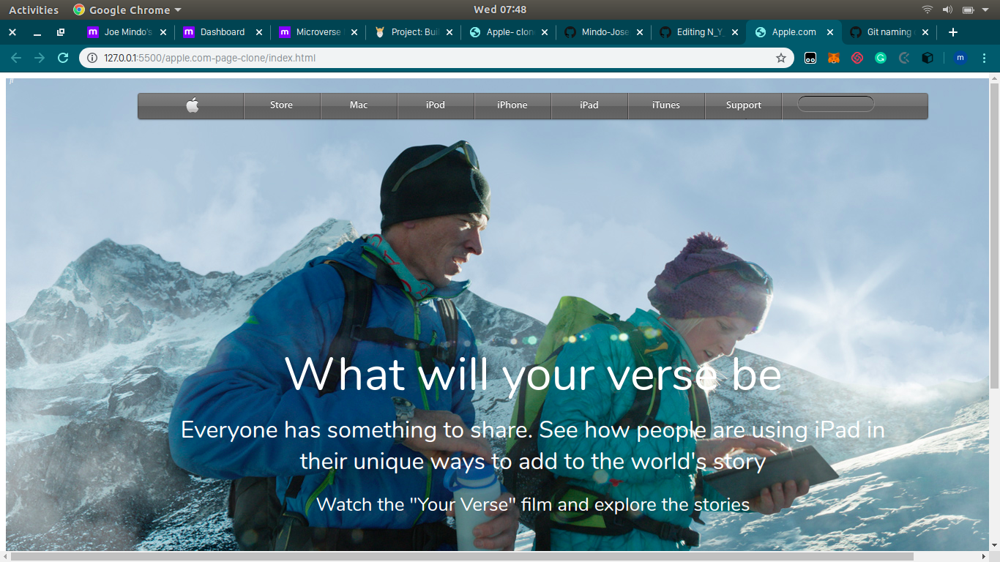

# Apple Homepage Clone

About the project
This HTML/CSS project is the fourth on the Microverse course. The aim of the project is to make a clone of apple.com homepage

The clone of the page contains a: 

- main section with nav

- footer section with links

- a list of images 

=======

## Built With

- HTML,
- CSS

## Live Demo

[Live Demo Link](http://htmlpreview.github.io/?https://github.com/Mindo-Joseph/apple.com-page-clone/blob/ft-main-landing-page-170502316/index.html)

👤 **Author**

- Github: [@MindoJoseph](https://github.com/Mindo-Joseph)
- Twitter: [@mindoJoseph](https://twitter.com/mindoJoseph)
- Linkedin: [Joseph Mindo](https://www.linkedin.com/in/joseph-mindo-367284132/)
- Google: mindo.joseph.mj@gmail.com

## 🤝 Contributing

Contributions, issues and feature requests are welcome!

Feel free to check the [issues page](https://github.com/Mindo-Joseph/apple.com-page-clone/issues).

## Show your support

Give a ⭐️ if you like this project!